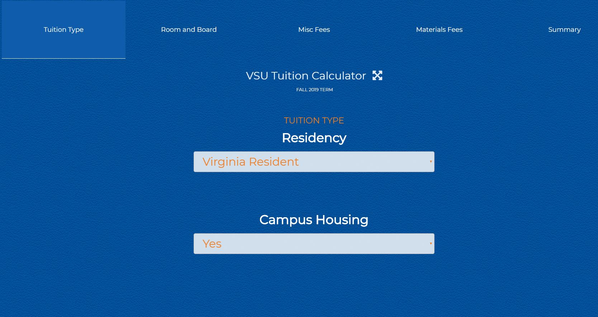
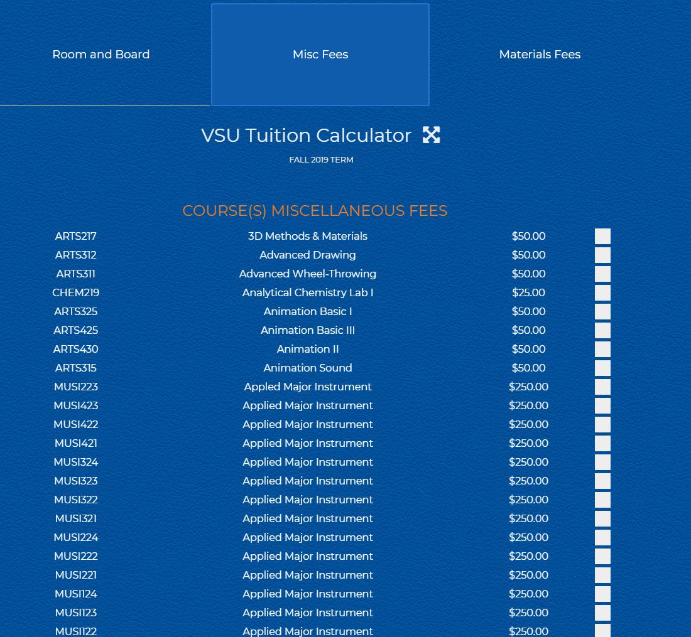
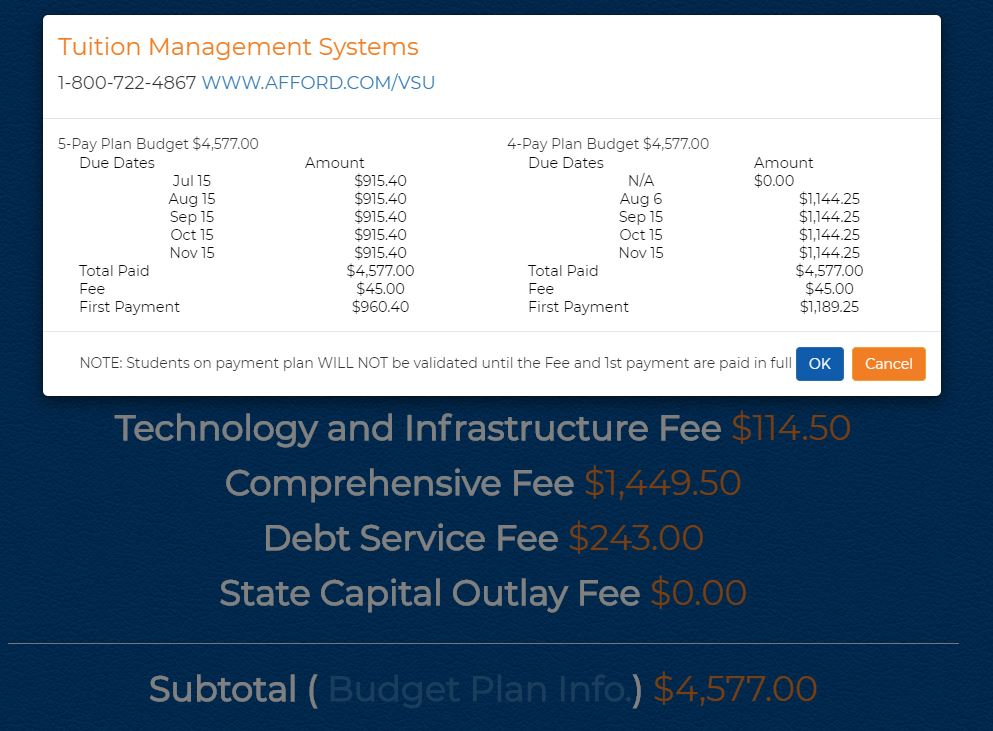

# tuition-calculator
> A tuition calculator application that is used for students
> to estimate the cost of enrollment at the university

 

---

## Users
- Prostpective, Current, and Transfer Students for VSU
- Project Owner - VSU Admissions
- Public users who visits VSU website
---

## Functions
This web application displays the estimated cost of enrolling at VSU by accessing a static data source and displaying results based on what options the user selects.

---

User first selects residency and campus housing

If user selects On-campus housing then user fills out Room and Board information such as room options, dormitory location, and meal plan.

User proceeds to Misc Fees tab and selects enrolled courses

User selects enrolled courses within the Materials Fees tab

User reviews costs within the Summary tab and adds any expected Financial Aid to receive an estimated tuition balance 

User may click on the Budget Plan Info link within the Summary tab to see a breakdown of a four or five pay budget plan based on in or out-of-state tuition rates

---

## Installation

To have a local install of the working project you would need to have the following:

- xampp
- Sublime text editor
- Download of local files through GitHub desktop app

---

## Overview

The tuition calculator app was developed to improve workflow for VSU admissions when calculating tuition for students.  

---

### Tuition Calculator Technical Functions

- values of tuition is stored within the .js file. Residency and housing are calculated within the DOM using Angular.  
   - If housing is on campus, user selects room, dorm and meal plan options.  Those values are added into the Summary Tab through Angular.
- The misc and materials fees are preliminary calculated with JQuery through a function that goes through checked boxes, tallies and hides value until user goes to the Summary Tab
- Depending on what values are selected an in-state or out-of-state invoice is displayed in the Summary Tab.  Both values must be selected for the Summary Tab to show.
- The Summary Tab calculations are completed within the DOM.
- Budget Plan modal is imported from AngularUI and is is opened through `ng-click` depending on what residency is selected.

- Toggle fullview is handled by JS for cross-platform compatibility
	- JQuery `#title` click event runs fullscreen or cancel fullscreen function.
	-function `toggleFull` switches fullscreen off or on.  This is implemented in Vanilla JavaScript for legacy support and cross-platform compatibilty.

-`mobile-menu btn-toggle nav` is enabled by default to fit within the constraints of the iframe in the current CMS. 

---
